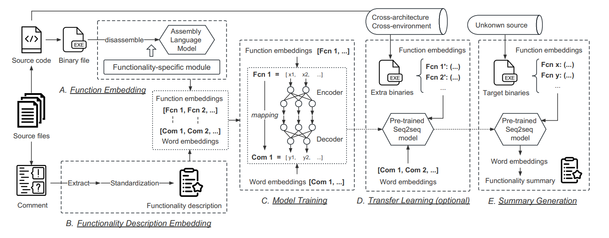

# Bin2Summary

## Introduction 

Bin2Summary is a novel framework to automatically summarize the functionality of the function in stripped binaries with natural language sentences. Specifically, it includes a functionality-specific code embedding module to facilitate fine-grained similarity detection and an attention-based seq2seq model to generate summaries in natural language.

<p align="center"></p>

This repository includes Bin2Summary source code (following for setup) and the [Supplementary material](https://drive.google.com/file/d/1s3_bKWKrYK1_6hEKAcsJbzEH_Bgtoyt1/view?usp=drive_link).

## Installation

We recommend `conda` to setup the environment and install the required packages. Conda installation instructions can be found [here](https://docs.conda.io/projects/conda/en/latest/user-guide/install/linux.html). The following setup assumes Conda is installed and is running on Linux system (though Windows should work too).

First, create the conda environment,

`conda create -n Bin2Summary python=3.6 gensim=4.0.1 matplotlib`

and activate the conda environment:

`conda activate Bin2Summary`

If you want to train the model with your gpu:

`pip install tensorflow-gpu==2.1.0`

Also, you need to install the `cudatoolkit` and `cudnn` depends on your GPU driver. 

If you want to use CPU version, we can:

`pip install tensorflow==2.1.0`

### Other Requirements

Depending on the assembly language model used, you need to install extra packages and use different disassembler (e.g., [Radare2](https://rada.re/n/), [BinaryNinja](https://binary.ninja/)) for function embedding. Please see corresponding README (e.g.,  [PalmTree](./src/palmtree_emb/README.md), [DeepBinDiff](./src/deepbindiff_emb/README.md),  [Asm2vec](./src/asm2vec_emb/README.md)).

## Dataset Preparation

### Dataset Construction (optional)

In this repository, we have prepared a set of `Coreutils` binaries compiled based on `x64` using [Cygwin](https://www.cygwin.com/). These sample binaries can be used to construct a small dataset.
For more details on how to generate training and testing datasets from binaries, please refer to the README under [`src/`](src/) with different assembly language model (e.g., [PalmTree](./src/palmtree_emb/README.md), [DeepBinDiff](./src/deepbindiff_emb/README.md),  [Asm2vec](./src/asm2vec_emb/README.md)), and you can also decide to apply FSE module or not.

#### Example: Function Embedding with [PalmTree](./src/palmtree_emb/README.md)

- Step 0: Go to the [`src/palmtree_emb`](./src/palmtree_emb/)
  ```
  cd src/palmtree_emb
  ```

- Step 1: Use script to ananlyze the binaries and generate CFG & DFG data (need binaryninja)
  ```
  python gen_asm.py [--FSE]
  ```

- Step 2: Use script to train assembly language model with CFG & DFG data
  ```
  [CUDA_VISIBLE_DEVICES=0] python train.py -d train
  ```

- Step 3: Use script to generate the function embeddings with the pre-trained assembly language model
  ```
  [CUDA_VISIBLE_DEVICES=0] python gen_emb.py [--FSE]
  ```

In case you are interested in using complete datasets or utilize other assembly language model and modules, you can try to conduct pre-processing by yourself. The complete datasets can be found in [Source code for dataset](https://drive.google.com/drive/folders/1D1fcsWCzm8-J4C_L2WiQ7rkib-sKHl2W?usp=sharing), [Raw binaries for dataset](https://drive.google.com/drive/folders/1ZgmuB5T2Ho5NRmJLozpUcmWvsEt3YxUT?usp=drive_link).

### Pre-processed Data

If you do not want to prepare the datasets (cause it costs much time), we provide a sample training/testing set [here](https://drive.google.com/drive/folders/1ZrL5BVrPF-hEkGTjWbvfocR2Zl6yj3Uk?usp=sharing). You can download and put them in [`data/`](./data/) directory.
The sample training/testing set is constructed using the binaries based on `x64` using [Cygwin](https://www.cygwin.com/), they are then pre-processed using `PalmTree-FSE` module.


## Model Training and Testing

To train and test a seq2seq model with the sample dataset in [`data/`](./data/):

```
bash command/seq2seq_train_test.sh
```

The specific hyper-parameters can be seen in [`palmtree_train.py`](./src/seq2seq/palmtree_train.py). For example:

```
BB_MAX_NUM = 300  # Maximum number of the basic blocks
BB_VECTOR_DIM = 128  # Embedding dimension of the input blocks
COMMENT_MAX_LEN = 15 # Maximum length of the comment
WORD_EMBEDDING_DIM = 128  # Embedding dimension of the output words
BATCH_SIZE_PER_REPLICA = 16 # Batch size
STEP_PER_EPOCH = 256 # Steps for each epoch
EPOCHS = 1000 # Maximum numbers of the epochs
HIDDEN_DIM = 512 # Hidden dimension of the seq2seq model
NETWORK_DEPTH = 6  # Number of layers of the seq2seq model
DROPOUT = 0.2 # Dropout rate
LR = 0.0002 # Initial learning rate
MIN_LR = 0.0000001 # Minimum learning rate
CALL_BACK_MONITOR = 'val_loss' # Call back monitor for checkpoint
```

The results will be stored at [`results/`](./results/).


## Citation

Coming soon.


<!--
**ExplainBinary/ExplainBinary** is a ✨ _special_ ✨ repository because its `README.md` (this file) appears on your GitHub profile.

Here are some ideas to get you started:

- 🔭 I’m currently working on ...
- 🌱 I’m currently learning ...
- 👯 I’m looking to collaborate on ...
- 🤔 I’m looking for help with ...
- 💬 Ask me about ...
- 📫 How to reach me: ...
- 😄 Pronouns: ...
- ⚡ Fun fact: ...
-->
